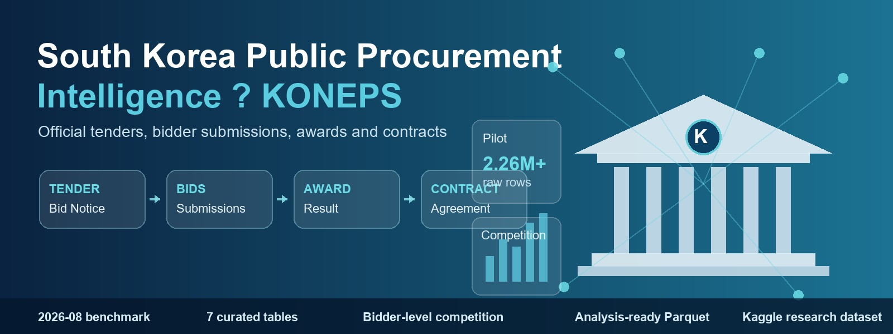

# South Korea Public Procurement Intelligence — KONEPS



[한국어](README.md) | **English**

[](https://github.com/TaeyanG4/koneps-procurement-intelligence/actions)
[](https://www.python.org/)
[-orange.svg)](https://parquet.apache.org/)

Reproducible data collection and ETL pipeline for South Korea's **KONEPS** (Korea ON-line E-Procurement System / 국가종합전자조달시스템) public procurement ecosystem.

Aims to build a research-ready public procurement dataset targeted for Kaggle:
> **"South Korea Public Procurement Intelligence — KONEPS"**

---

## 1. Project Purpose

Every year, the South Korean government procures over **$100 billion+ USD** in goods, construction works, and services through KONEPS. Despite the vast transparency of this open data, the raw government feeds are difficult for international data scientists to analyze due to:
- Complex temporal chunking and nested XML/JSON schemas.
- Monolithic Korean administrative column names.
- Fragmented records across separate bidding, award, contract, and bidder outcome feeds.

This repository provides an automated, resumable data engineering pipeline connecting the full procurement lifecycle:

$$\text{Tender Notice} \longrightarrow \text{Bidders / Bid Submissions} \longrightarrow \text{Award / Selection} \longrightarrow \text{Contract} \longrightarrow \text{Supplier} \longrightarrow \text{Procuring Agency}$$

---

## 2. Why KONEPS Data Matters for Data Science & ML

The KONEPS dataset is an exceptional benchmark for real-world tabular data science, econometrics, and machine learning:
1. **Auction Theory & Bid Distribution**: Study how bid prices cluster near expected prices, examine bidding floor dynamics, and detect statistical anomalies.
2. **Predictive Modeling**:
   - Predict winning bid rates (`award_rate`) and competition density (`bidder_count`).
   - Identify tender failure risks (`is_failed_bid`) before bid opening.
   - Forecast supplier win probability conditioned on historical win rates and market concentration.
3. **Public Spending Transparency**: Measure agency-level price variance, regional joint-venture effects, and market concentration (HHI index).

---

## 3. Pipeline Architecture

The pipeline enforces strict separation of concerns across data layers and ensures fault-tolerant idempotency:

```
[ data.go.kr API ]                [ Official Bidder Report ]
         │                                    │
         ▼                                    ▼
  (Paced Requests)                   (CSV / XLS / XLSX)
         │                                    │
         ▼                                    ▼
  data/raw/*.jsonl.gz                scripts/ingest_bidder_report.py
  (Immutable Raw + Manifest)                  │
         │                                    ▼
         │                          data/processed/bidder_outcomes/
  scripts/build_dataset.py
         │
         ▼
  data/processed/<dataset>/year=YYYY/month=MM/*.parquet
  (Canonical English + Korean Columns + Strict Types)
         │
         ▼
  scripts/quality_check.py
  (Cardinality Inspection, Duplicate Auditing, Anomaly Bounds)
         │
         ▼
  [ ML-Ready Curated Tables & Kaggle Publication ]
```

- **`data/raw/`**: Immutable, compressed JSONL archives (`*.jsonl.gz`) tracking window metadata and completion status in `manifest.json`.
- **`data/staging/`**: Intermediate scratch files for join and schema validation.
- **`data/processed/`**: Partitioned, type-safe Parquet files with Zstandard compression (`year=YYYY/month=MM/`).
- **`data/logs/`**: Detailed run logs with automatic secret sanitization.

---

## 4. Primary Data Sources

1. **KONEPS Public Data Open Standard Service (`PubDataOpnStdService`)**:
   - **Tenders (`bids`)**: Announcement metadata, budgets, deadlines, and procurement methods.
   - **Awards (`awards`)**: Opening ranks, winning bids, winning suppliers, scheduled prices, and bidder counts.
   - **Contracts (`contracts`)**: Final contracted values, execution dates, and contracting parties.
2. **Official Bidder Outcome Report Export (`bidder_outcomes`)**:
   - Official portal export providing comprehensive company-level submissions (all bidders, business numbers, submitted amounts, bid rates, and disqualification reasons).

> **Licensing & Terms of Use**: Specific terms of use for each raw dataset follow the scope of permission indicated on the respective service page on data.go.kr and KONEPS. Terms of use per data source will be re-verified prior to Kaggle redistribution. For detailed per-source notes, see [DATA_SOURCES.md](docs/DATA_SOURCES.md).


---

## 5. Installation & Setup

Recommended Python version: **3.11** or **3.12**.

### Windows (PowerShell)
```powershell
# 1. Create and activate virtual environment
python -m venv .venv
.venv\Scripts\Activate.ps1

# 2. Install dependencies
pip install -r requirements.txt
pip install -e .
```

### Linux / macOS (Bash)
```bash
# 1. Create and activate virtual environment
python3 -m venv .venv
source .venv/bin/activate

# 2. Install dependencies
pip install -r requirements.txt
pip install -e .
```

---

## 6. API Key Setup

1. Register an account on [data.go.kr](https://www.data.go.kr/).
2. Apply for `조달청_나라장터 공공데이터개방표준서비스` (Standard Open Data Service, automatic instant approval).
3. Copy your **decoding service key** (일반 인증키 - Decoding).
4. Create a local `.env` file from `.env.example`:

### Windows (PowerShell)
```powershell
Copy-Item .env.example .env
# Edit .env and paste your key:
# DATA_GO_KR_SERVICE_KEY=your_actual_key_here
```

### Linux / macOS (Bash)
```bash
cp .env.example .env
# Edit .env and paste your key
```

> **Security Guarantee**: `.env` is strictly ignored by Git. Keys are masked in all console logs (e.g. `abcd********wxyz`) and stripped from error traces.

---

## 7. Step-by-Step Collection Guide

### Step 1: 1-Day API Smoke Test
Verify credentials, endpoint connectivity, and raw storage without consuming excessive API quota:

**PowerShell:**
```powershell
python scripts/collect_standard.py --dataset bids --start 2026-09-01 --end 2026-09-01 --page-size 100
```
**Bash:**
```bash
python scripts/collect_standard.py --dataset bids --start 2026-09-01 --end 2026-09-01 --page-size 100
```

*To verify window splitting logic without making network calls, add `--dry-run`.*

### Step 2: 1-Month Collection
Collect all feeds for a recent single month:

**PowerShell:**
```powershell
python scripts/collect_standard.py --dataset all --start 2026-08-01 --end 2026-08-31 --page-size 500
```
**Bash:**
```bash
python scripts/collect_standard.py --dataset all --start 2026-08-01 --end 2026-08-31 --page-size 500
```

### Step 3: 1-Year Historical MVP Collection
Collect the initial target historical range (e.g. 2025-09-01 to 2026-09-01):

**PowerShell:**
```powershell
python scripts/collect_standard.py --dataset all --start 2025-09-01 --end 2026-09-01 --page-size 500
```
**Bash:**
```bash
python scripts/collect_standard.py --dataset all --start 2025-09-01 --end 2026-09-01 --page-size 500
```

> **Resumability**: The collector uses `data/raw/manifest.json`. If a job is stopped or daily quotas are reached, re-running the exact same command skips already-completed chunks.

---

## 8. Bidder Outcome Report Ingestion

To ingest the official bidder export containing company-level bid amounts, rankings, and reasons:

**PowerShell:**
```powershell
python scripts/ingest_bidder_report.py path\to\exported_report.xlsx
```
**Bash:**
```bash
python scripts/ingest_bidder_report.py path/to/exported_report.xlsx
```
- Supported formats: `.csv` (auto-detecting `utf-8-sig`, `cp949`, `euc-kr`), `.xlsx`, and real binary `.xls` (via `xlrd`).
- Normalized outputs are stored in `data/processed/bidder_outcomes/`.

---

## 9. Build Partitioned Parquet

Convert raw `.jsonl.gz` files into typed, partitioned Parquet datasets:

**PowerShell:**
```powershell
python scripts/build_dataset.py
```
**Bash:**
```bash
python scripts/build_dataset.py
```
Outputs partitioned analytical files:
```
data/processed/bids/year=2026/month=08/*.parquet
data/processed/awards/year=2026/month=08/*.parquet
data/processed/contracts/year=2026/month=08/*.parquet
data/processed/build_report.json
```

---

## 10. Quality Checks & Anomaly Audits

Run automated profiling to check row counts, duplicate keys, null ratios, and numeric anomalies (such as negative prices or impossible bid rates):

**PowerShell:**
```powershell
python scripts/quality_check.py data/processed/**/*.parquet --strict
```
**Bash:**
```bash
python scripts/quality_check.py data/processed/*/*/*.parquet --strict
```

---

## 11. Directory Structure

```
koneps-procurement-intelligence/
├── src/
│   └── koneps_intel/
│       ├── __init__.py           # Package exports & version
│       ├── api.py               # Resilient HTTP client & exponential backoff
│       ├── config.py            # Environment config & key redaction
│       ├── endpoints.py         # Feed definitions & API parameters
│       ├── collector.py         # Collection orchestrator & recovery
│       ├── storage.py           # Raw storage & manifest tracking
│       ├── parsers.py           # Response extractors & window generators
│       ├── schemas.py           # Column aliases & controlled vocabularies
│       ├── normalize.py         # Type casting & Parquet conversion
│       ├── quality.py           # Quality checks & anomaly detection
│       ├── audit.py             # Pilot audit & collision forensics engine
│       ├── privacy.py           # HMAC-SHA256 enterprise pseudonymization
│       ├── curate.py            # Relational curation & reconciliation pipeline
│       └── utils.py             # Structured logging & secret filtering
│
├── scripts/
│   ├── collect_standard.py      # Raw collection CLI
│   ├── build_dataset.py         # Parquet normalization CLI
│   ├── build_curated.py         # 7 curated relational tables builder CLI
│   ├── audit_pilot.py           # Pilot audit & metrics generator CLI
│   ├── build_docs.py            # Project DOCX generator & hash verifier CLI
│   ├── ingest_bidder_report.py  # Bidder report ingestion CLI
│   └── quality_check.py         # Quality profiling CLI
│
├── data/
│   ├── raw/                     # Raw immutable .jsonl.gz files
│   ├── staging/                 # Intermediate processing scratchpad
│   ├── processed/               # Partitioned Parquet datasets
│   │   └── curated/             # 7 normalized relational curated Parquet (ZSTD)
│   └── logs/                    # Pipeline execution logs
│
├── tests/
│   ├── fixtures/                # Mock API responses and sample files
│   ├── test_api.py              # API client & error handling tests
│   ├── test_parsers.py          # Response & window parsing tests
│   ├── test_collector.py        # Collection & resume logic tests
│   ├── test_normalize.py        # Schema casting & Parquet tests
│   ├── test_curate.py           # Curated tables, surrogate PKs & privacy tests
│   ├── test_quality.py          # Quality profiling & anomaly tests
│   └── test_text_integrity.py   # Encoding & text corruption tests
│
├── docs/
│   ├── ARCHITECTURE.md          # System architecture & integrity principles (Korean)
│   ├── ARCHITECTURE.en.md       # System architecture & integrity principles (English)
│   ├── DATA_SOURCES.md          # Data sources & licensing guide (Korean)
│   ├── DATA_SOURCES.en.md       # Data sources & licensing guide (English)
│   ├── DATA_DICTIONARY.md       # Canonical schemas & field descriptions (Korean)
│   ├── DATA_DICTIONARY.en.md    # Canonical schemas & field descriptions (English)
│   ├── LIVE_VALIDATION.md       # 1-day live smoke test report (Korean)
│   ├── LIVE_VALIDATION.en.md    # 1-day live smoke test report (English)
│   ├── PILOT_2026_08.md         # August 2026 pilot audit report (Korean)
│   ├── PILOT_2026_08.en.md      # August 2026 pilot audit report (English)
│   ├── RELATIONAL_MODEL.md      # Relational join specification (Korean)
│   ├── RELATIONAL_MODEL.en.md   # Relational join specification (English)
│   └── generated/               # Generated project Word (.docx) documentation
│
├── .github/
│   └── workflows/
│       └── ci.yml               # Automated GitHub CI testing workflow
│
├── .env.example                 # Template for environment credentials
├── .gitignore                   # Exclusions for secrets, caches, and datasets
├── pyproject.toml               # Package build configuration & pytest options
├── requirements.txt             # Locked dependencies
├── PROJECT_STATUS.md            # Implementation roadmap and status
├── README.md                    # Korean project documentation (Primary)
└── README.en.md                 # English project documentation
```

---

## 12. Documentation Index

All core technical designs, data dictionaries, and empirical validation reports are maintained in both English and Korean Markdown, as well as generated Word (.docx) documents:

| Document | English Markdown | Korean Markdown | English DOCX | Korean DOCX |
| :--- | :--- | :--- | :--- | :--- |
| **System Architecture** | [ARCHITECTURE.en.md](docs/ARCHITECTURE.en.md) | [ARCHITECTURE.md](docs/ARCHITECTURE.md) | [ARCHITECTURE.en.docx](docs/generated/ARCHITECTURE.en.docx) | [ARCHITECTURE.ko.docx](docs/generated/ARCHITECTURE.ko.docx) |
| **Data Sources & Licensing** | [DATA_SOURCES.en.md](docs/DATA_SOURCES.en.md) | [DATA_SOURCES.md](docs/DATA_SOURCES.md) | [DATA_SOURCES.en.docx](docs/generated/DATA_SOURCES.en.docx) | [DATA_SOURCES.ko.docx](docs/generated/DATA_SOURCES.ko.docx) |
| **Data Dictionary** | [DATA_DICTIONARY.en.md](docs/DATA_DICTIONARY.en.md) | [DATA_DICTIONARY.md](docs/DATA_DICTIONARY.md) | [DATA_DICTIONARY.en.docx](docs/generated/DATA_DICTIONARY.en.docx) | [DATA_DICTIONARY.ko.docx](docs/generated/DATA_DICTIONARY.ko.docx) |
| **Live API Validation** | [LIVE_VALIDATION.en.md](docs/LIVE_VALIDATION.en.md) | [LIVE_VALIDATION.md](docs/LIVE_VALIDATION.md) | [LIVE_VALIDATION.en.docx](docs/generated/LIVE_VALIDATION.en.docx) | [LIVE_VALIDATION.ko.docx](docs/generated/LIVE_VALIDATION.ko.docx) |
| **August 2026 Pilot Audit** | [PILOT_2026_08.en.md](docs/PILOT_2026_08.en.md) | [PILOT_2026_08.md](docs/PILOT_2026_08.md) | [PILOT_2026_08.en.docx](docs/generated/PILOT_2026_08.en.docx) | [PILOT_2026_08.ko.docx](docs/generated/PILOT_2026_08.ko.docx) |
| **Relational Model Spec** | [RELATIONAL_MODEL.en.md](docs/RELATIONAL_MODEL.en.md) | [RELATIONAL_MODEL.md](docs/RELATIONAL_MODEL.md) | [RELATIONAL_MODEL.en.docx](docs/generated/RELATIONAL_MODEL.en.docx) | [RELATIONAL_MODEL.ko.docx](docs/generated/RELATIONAL_MODEL.ko.docx) |

---

## 13. Schema & Key Metrics

The pipeline standardizes verbose Korean administrative column names into clean, ML-ready canonical English identifiers:

| Dataset | Primary Key | Key Analytical Features |
| :--- | :--- | :--- |
| **Tenders (`bids`)** | `bid_notice_no`, `bid_notice_round` | `budget_amount`, `estimated_price`, `bid_method`, `contract_method`, `is_re_bid` |
| **Awards (`awards`)** | `bid_notice_no`, `bid_notice_round`, `bidder_business_registration_no`, `bid_amount_krw`, `bid_submission_time`, `opening_rank` | `bid_amount_krw`, `bid_rate`, `scheduled_price`, `award_amount_krw`, `is_selected_winner` |
| **Contracts (`contracts`)** | `unified_contract_no` | `contract_amount`, `contract_date`, `agency_name`, `supplier_name`, `contract_method` |
| **Bidder Outcomes (`bidder_outcomes`)** | `bid_notice_no`, `bidder_business_registration_no` | `bid_amount`, `bid_rate`, `rank`, `is_selected_winner`, `disqualification_reason` |

For exhaustive data types, Korean source field names, and nullability constraints, see [DATA_DICTIONARY.md](docs/DATA_DICTIONARY.md).

---

## 14. Kaggle Dataset Packaging Guide

The Kaggle v1 payload for 2025-09-01 through 2026-08-31 is complete and published as [KONEPS Public Procurement Intelligence](https://www.kaggle.com/datasets/taeyangg4/koneps-public-procurement-intelligence).

| File | Rows | Role |
| :--- | ---: | :--- |
| `01_tenders.parquet` | 470,937 | tender master |
| `02_bidder_submissions.parquet` | 35,907,867 | individual bid submissions |
| `03_award_outcomes.parquet` | 305,995 | selected award outcomes |
| `04_contracts.parquet` | 1,894,598 | contract master |
| `05_suppliers.parquet` | 261,474 | HMAC-pseudonymized supplier dimension |
| `06_agencies.parquet` | 27,214 | public agency dimension |
| `07_tender_contract_bridge.parquet` | 637,107 | tender-contract relationship bridge |

```bash
python scripts/build_historical_curated.py --start 2025-09-01 --end 2026-08-31 --processed data/processed/historical_202509_202608
python scripts/build_kaggle_release.py --start 2025-09-01 --end 2026-08-31
```

The final payload is written to `data/processed/kaggle_release_202509_202608/` and is about 2.61 GB. On 2026-09-11, live Kaggle readback confirmed `ready` status, exact remote byte sizes for all seven files, the custom cover, source provenance, the `other` license, and monthly update frequency. The metadata uses `other` rather than inventing a Creative Commons license, faithfully reflecting the source service's current unrestricted scope of license. A fast public walkthrough is available as [KONEPS Procurement: 5-Minute Market Overview](https://www.kaggle.com/code/taeyangg4/koneps-procurement-5-minute-market-overview); v2 completed successfully in the Kaggle runtime. See [HISTORICAL_RELEASE_2025_09_2026_08.en.md](docs/HISTORICAL_RELEASE_2025_09_2026_08.en.md) for full validation details.

---

## 15. Exploratory Data Analysis & Machine Learning Ideas

- **Award Rate Prediction (Regression)**: Predict `award_rate` using tender budget, category code, seasonality, and procuring agency history.
- **Tender Failure Early Warning (Classification)**: Predict `is_failed_bid` prior to bid opening using requirement string complexity and announcement duration.
- **Supplier Win Probability Modeling**: Estimate a supplier's probability of winning conditioned on historical participation, average bid rate discount, and market concentration.
- **Procurement Market Concentration & Collusion Indicators**:
  - Network graph analysis of repeated co-bidding cartels within specific procuring agencies.
  - Entropy analysis of bid rate clustering and suspicious price step intervals.
  - Herfindahl-Hirschman Index (HHI) monitoring across procurement sectors.

---

## 16. Security & Data Governance Policy

- **No Secrets in Git**: Service keys are never committed and must be provided via local `.env`.
- **Code Only in GitHub**: Collected procurement datasets are excluded from Git (`.gitignore`) and distributed via Kaggle Datasets.
- **Privacy & Identifier Protection**: The Kaggle v1 payload uses only a dedicated-secret HMAC-SHA256 `supplier_id`; raw/masked business registration numbers and supplier company names are excluded.
- **Data Provenance & License Verification**: The standard service page was re-verified on 2026-09-11 and currently lists its scope of license as unrestricted. Any separate KONEPS portal export added later will be verified independently.

---

## 17. Implementation & Verification Status

| Component | Status | Verification |
| :--- | :--- | :--- |
| **API Client (`api.py`)** | IMPLEMENTED | Verified with unit mocks & error simulations (exponential backoff for 429/500, non-retryable 4xx fast fail, quota limit handling). |
| **Manifest & Resumability (`storage.py`, `collector.py`)** | IMPLEMENTED | Verified across recovery scenarios (category mismatch prevention, missing/corrupted files, manifest reconstruction Cases A–E). |
| **Normalization & Partitioning (`normalize.py`)** | IMPLEMENTED | Verified with nullable boolean (`boolean` dtype), datetime normalization (`opening_date` $\rightarrow$ `datetime64[ns]`), and date partitioning. |
| **Bidder Report Ingestion (`ingest_bidder_report.py`)** | IMPLEMENTED | Verified with CSV (`utf-8-sig`, `cp949`), `.xlsx`, and real binary `.xls` (via `xlrd`). |
| **Quality Profiling (`quality.py`, `quality_check.py`)** | IMPLEMENTED | Verified with clean and anomalous parquet frames. |
| **CI Automation (`ci.yml`)** | IMPLEMENTED | Automated testing on Python 3.11 & 3.12 across all pushes and pull requests. |
| **Live API Authentication & 1-Day Smoke Test** | VERIFIED | Completed 1-day live collection and Parquet normalization for 2026-09-01 across bids, awards, and contracts. |
| **1-Month Benchmark & Pilot Validation** | VERIFIED | Completed August 2026 pilot across all feeds (2,268,948 raw rows, 2,256,788 Parquet rows) with zero data corruption (see [PILOT_2026_08.md](docs/PILOT_2026_08.md)). |
| **Pilot Audit Correction & Relational Model** | VERIFIED | Scoped event-date filtering, lossless deduplication grain, and [RELATIONAL_MODEL.md](docs/RELATIONAL_MODEL.md) specification completed. |
| **Relational Curated Tables** | VERIFIED | Seven relational tables validated on the August pilot and all 12 months from 2025-09 through 2026-08 with monthly reconciliation/privacy gates. |
| **Historical 1-Year Live Crawl** | VERIFIED | 41,225,145 canonical raw rows collected and 38,273,402 normalized fact rows audited. |
| **Local Kaggle v1 Payload** | PACKAGED | Seven ZSTD Parquet files, 2,612,589,280 bytes, privacy-minimized supplier identity, per-file SHA-256 receipts. |
| **Live Kaggle v1 Publication** | PUBLISHED | Public Dataset is `ready`; seven remote file sizes match exactly; cover/provenance/license/monthly frequency are verified; starter EDA v2 is `COMPLETE`. Data Explorer file/column-description reflection remains a separate platform follow-up. |

---

## 18. Roadmap & Next Steps

1. ~~**Perform 1-Day Live Smoke Test**~~: Completed (verified across all 3 feeds for 2026-09-01).
2. ~~**Collect 1-Month Benchmark & Audit**~~: Completed (August 2026 crawl with 2.26M rows and detailed audit report in [PILOT_2026_08.md](docs/PILOT_2026_08.md)).
3. ~~**Correct Pilot Audit & Formulate Relational Model**~~: Completed (lossless grain verified, [RELATIONAL_MODEL.md](docs/RELATIONAL_MODEL.md) published).
4. ~~**Implement Relational Curated Tables**~~: Completed as restartable monthly curation across the full 12-month scope.
5. ~~**Collect, audit, and package the 1-Year MVP**~~: Completed for 2025-09 through 2026-08 with bilingual release validation documentation.
6. ~~**Publish Kaggle Research Dataset v1**~~: Public Dataset v1 and starter EDA v2 are live and execution-verified; Data Explorer description reflection is tracked separately as a platform follow-up.
7. **Build the leak-free ML feature layer**: Generate supplier, agency, and market history features using only information available before each observation time.
