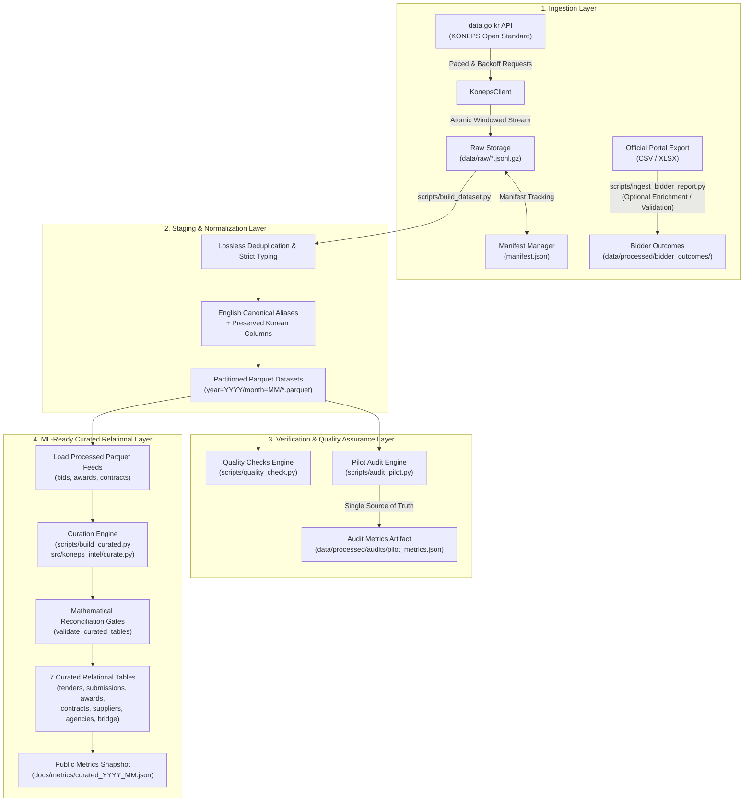

# System Architecture & Pipeline Design

[한국어](ARCHITECTURE.md) | **English**

This document details the end-to-end data pipeline architecture for **KONEPS Procurement Intelligence**.

---

## 1. High-Level Flow

---

## 2. Core Architectural Principles

### 1. Immutable Raw Source Preservation
- Raw API payloads are stored in compressed JSON Lines format (`data/raw/<dataset>/*.jsonl.gz`).
- The pipeline never mutates or drops original raw fields during ingestion.
- The raw layer is entirely self-sufficient: the processed Parquet files can be completely reconstructed from `data/raw/` without making a single external API call.

### 2. Bulletproof Resumability & Completion Manifests
- Historical data collection spans months or years and requires robust fault-tolerance.
- The `ManifestManager` records every completed window in `data/raw/manifest.json`, tracking:
  - `dataset`, `endpoint`, `start`, `end`, `category`
  - `download_timestamp`, `row_count`, `total_expected`, `api_calls`, `status`
- Any re-run skips already-downloaded windows automatically.
- If daily API quota limits are encountered (`QuotaExceededError`), the pipeline halts cleanly without data corruption, allowing seamless resumption the following day.

### 3. Strict Raw → Staging → Processed Separation
- `data/raw/`: Read-only, immutable gzipped JSONL archives.
- `data/staging/`: Temporary extraction, intermediate join validation, or scratch processing.
- `data/processed/`: Partitioned, schema-enforced, Zstandard-compressed Parquet files.
- `data/logs/`: Structured pipeline execution logs with credential masking.

### 4. Dual Korean + Canonical English Column Strategy
- International Kaggle users need accessible, standardized column naming (e.g. `bid_notice_no`, `bid_amount_krw`).
- However, automated translation of Korean technical procurement terminology can destroy nuanced legal and administrative context.
- **Strategy**:
  1. Add clean, canonical English alias columns.
  2. Retain all original Korean source columns.
  3. Provide explicit controlled mappings for standard categories (e.g. `goods`, `services`, `works`).

### 5. Join Cardinality Discipline
- Direct joining across multi-grain datasets without validation causes catastrophic Cartesian row explosion.
- Empirically verified relationships:
  - **Tender Notice (`tenders`) 1 → N Bidder Submissions (`bidder_submissions`)**: up to 9,675 bidders per tender.
  - **Tender Notice (`tenders`) 1 → 0..N Award Decisions (`award_outcomes`)**: single-winner (67.02%), failed/pending (32.82%), multi-winner/lot (0.16%).
  - **Tender Notice (`tenders`) 1 → 0..N Contracts (`contracts`)**: notice-linked contracts (35.08%), off-notice private/direct contracts (64.92%).

### 6. Curated Relational & Privacy Preservation
- `CURATED_SCHEMA_VERSION = "1.0.0"`: 7 normalized physical curated tables generated under `data/processed/curated/YYYY_MM/`.
- Deterministic Surrogate PKs: `BID_<32 hex>` and `AWD_<32 hex>` preserve the underlying business grain while enabling O(1) single-column relational joins.
- Zero PII Guarantee: Raw business registration numbers, representative names, telephone numbers, street addresses, and emails are purged; public releases include HMAC-SHA256 pseudonymized `supplier_id` and masked `masked_biz_no` (`123-45-*****`).
- Secret Key Separation: API access credentials (`DATA_GO_KR_SERVICE_KEY`) and pseudonymization keys (`KONEPS_SUPPLIER_HMAC_KEY`) are kept strictly independent.
- Temporal Foreign Key Tracking: The `tender_in_scope: bool` flag explicitly tracks cross-period boundary effects without discarding valid bids or contracts.

---

## 3. Reassessment of the Bidder Report Role

Because the live OpenAPI feed `getDataSetOpnStdScsbidInfo` already provides full-fidelity bidder submissions (business registration numbers, bid amounts, bid rates, timestamps, ranks, and disqualification reasons), the role of the portal bidder report export (`bidder_outcomes` CSV/XLS/XLSX) is adjusted to **Optional Enrichment & Cross-Validation**.

---

## 4. Dataset Publication & Format Policy

- **Canonical Analytical Format**: Partitioned Apache Parquet (Zstandard compression) partitioned by `year=YYYY/month=MM/`.
- **Raw Storage**: Gzipped JSON Lines (`*.jsonl.gz`).
- **Auxiliary Exports**: CSV for data dictionaries and summary dimension tables; XLSX for small human reports under 100,000 rows.
- Multi-million-row submission tables are never distributed as XLS/XLSX.
