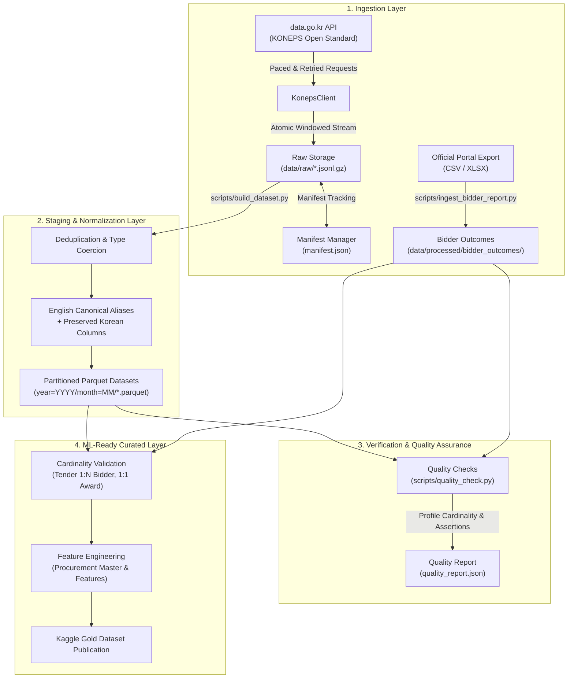

# Architecture & Pipeline Design

This document details the end-to-end data pipeline architecture for **KONEPS Procurement Intelligence**.

---

## 1. High-Level Flow

---

## 2. Core Architectural Principles

### 1. Immutable Raw Source Preservation
- Raw API payloads are stored in compressed JSON Lines format (`data/raw/<dataset>/*.jsonl.gz`).
- The pipeline never mutates or drops original raw fields during ingestion.
- The raw layer is entirely self-sufficient: the processed Parquet files can be completely reconstructed from `data/raw/` without making a single external API call.

### 2. Bulletproof Resumability & Completion Manifests
- Historical data collection spans months or years and requires robust fault-tolerance.
- The `ManifestManager` records every completed window in `data/raw/manifest.json`, tracking:
  - `dataset`, `endpoint`, `start`, `end`, `category`
  - `download_timestamp`, `row_count`, `total_expected`, `api_calls`, `status`
- Any re-run skips already-downloaded windows automatically.
- If daily API quota limits are encountered (`QuotaExceededError`), the pipeline halts cleanly without data corruption, allowing seamless resumption the following day.

### 3. Strict Raw ? Staging ? Processed Separation
- `data/raw/`: Read-only, immutable gzipped JSONL archives.
- `data/staging/`: Temporary extraction, intermediate join validation, or scratch processing.
- `data/processed/`: Partitioned, schema-enforced, Zstandard-compressed Parquet files.
- `data/logs/`: Structured pipeline execution logs.

### 4. Dual Korean + Canonical English Column Strategy
- International Kaggle users need accessible, standardized column naming (e.g. `bid_notice_no`, `bid_amount_krw`).
- However, automated translation of Korean technical procurement terminology can destroy nuanced legal and administrative context.
- **Strategy**:
  1. Add clean, canonical English alias columns.
  2. Retain all original Korean source columns.
  3. Provide explicit controlled mappings for standard categories (e.g. `goods`, `services`, `works`).

### 5. Join Cardinality Discipline
- Direct joining across multi-grain datasets (e.g., tender announcements, bidder submissions, contract modifications) without validation causes catastrophic Cartesian row explosion.
- Uniqueness and duplicate rates must be measured across candidate keys (`bidNtceNo`, `bidNtceOrd`, `bizno`, `cntrctNo`).
- Master joins are constructed only after empirical cardinality is confirmed:
  - **Tender (1) ? Bidder Outcomes (N)**
  - **Tender (1) ? Award (1 or N)**
  - **Tender (1) ? Contract (1 or N)**
