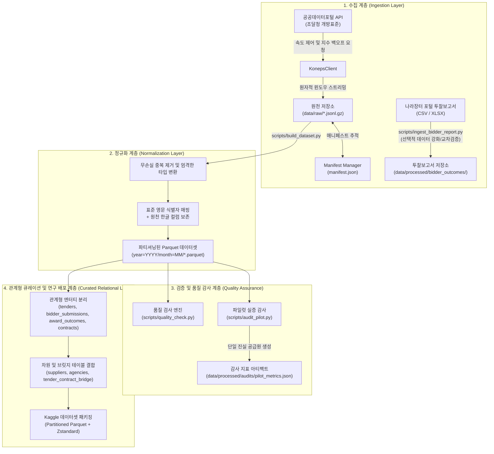

# 시스템 아키텍처 및 파이프라인 설계

**한국어** | [English](ARCHITECTURE.en.md)

본 문서는 **대한민국 공공조달 인텔리전스 (KONEPS Procurement Intelligence)**의 종단간(End-to-End) 데이터 엔지니어링 및 ETL 파이프라인 구조를 기술합니다.

---

## 1. 상위 계층 파이프라인 흐름

---

## 2. 핵심 아키텍처 설계 원칙

### 1. 불변 원천 데이터 보존 (Immutable Raw Preservation)
- 공공데이터포털 API로부터 수신한 원본 JSON 레코드는 gzip 압축 라인 단위 텍스트(`data/raw/<dataset>/*.jsonl.gz`)로 저장됩니다.
- 수집 파이프라인은 원천 데이터를 임의로 변경하거나 누락하지 않고 100% 그대로 기록합니다.
- 원천 저장소는 완전한 독립성을 지니며, 외부 API 호출 없이도 `data/raw/`에서 정규화 Parquet을 100% 재현할 수 있습니다.

### 2. 장애 복구 멱등성 및 매니페스트 관리 (Bulletproof Resumability)
- 대용량 데이터 수집 작업의 중단 및 재개를 안전하게 관리하기 위해 `ManifestManager`가 모든 윈도우 수집 결과를 `data/raw/manifest.json`에 원자적으로 기록합니다.
- 네트워크 단절, 프로세스 강제 종료 또는 일일 호출 할당량 소진(`QuotaExceededError`) 발생 시, 파이프라인은 데이터 손상 없이 정상 종료되며 다음 실행 시 완료된 구간을 자동으로 건너뜁니다.

### 3. 엄격한 원천 → 스테이징 → 정규화 분리 (Strict Raw → Staging → Processed Separation)
- `data/raw/`: 읽기 전용 불변 Gzip JSONL 아카이브.
- `data/staging/`: 스키마 유효성 검증 및 중간 결합 임시 영역.
- `data/processed/`: 엄격한 데이터 타입 및 날짜 파티셔닝이 적용된 고성능 Zstandard Parquet 저장소.
- `data/logs/`: 인증키가 자동 마스킹된 실행 로그 보관.

### 4. 한글 원천 보존 및 표준 영문 컬럼 매핑 (Dual Column Strategy)
- 국제 데이터 사이언스 커뮤니티 연구자를 위해 표준 영문 컬럼명(예: `bid_notice_no`, `bid_amount_krw`)을 부여합니다.
- 동시에 한국 조달 행정의 세부적 법적 뉘앙스를 보존하기 위해 원천 한글 필드명(`bidNtceNm`, `opengRsltDivNm` 등)을 그대로 함께 유지합니다.

### 5. 조인 카디널리티 규율 (Join Cardinality Discipline)
- 다대다 및 일대다 관계가 혼재된 조달 데이터를 무분별하게 단일 마스터 테이블로 결합하면 심각한 행 뻥튀기(Cartesian explosion)가 발생합니다.
- 실증된 카디널리티 관계:
  - **입찰공고 (`tenders`) 1 → N 투찰기록 (`bidder_submissions`)**: 공고 1건당 최대 9,675개사 투찰.
  - **입찰공고 (`tenders`) 1 → 0..N 개찰/낙찰결과 (`award_outcomes`)**: 단일 낙찰 67.02%, 유찰 32.82%, 복수낙찰/다수물품 0.16%.
  - **입찰공고 (`tenders`) 1 → 0..N 계약내역 (`contracts`)**: 공고 연계 계약 35.08%, 미연계 자체/수의계약 64.92%.

---

## 3. 포털 투찰보고서의 역할 재정의

실 API `awards` 피드에서 개별 투찰 기업 식별자, 투찰 금액, 투찰률, 투찰 시간, 개찰 순위, 탈락 사유가 전수 제공됨에 따라, 웹 포털에서 수동 다운로드하는 상세 투찰보고서(`bidder_outcomes`)는 대용량 파이프라인의 필수 종속성이 아닌 **선택적 교차 검증 및 보조 데이터 강화(Optional Enrichment)** 역할로 운영됩니다.

---

## 4. 데이터 배포 포맷 정책 (Release Policy)

- **정규 분석용 데이터셋 (Canonical)**: 날짜 파티셔닝(`year=YYYY/month=MM/`)이 적용된 Apache Parquet (Zstandard 압축).
- **원천 아카이브**: JSONL.GZ.
- **보조 편의용 파일 (Auxiliary)**: 데이터 사전 및 소규모 요약 통계 테이블에 한해 CSV 제공. 10만 행 미만의 요약 리포트에 한해 XLSX 제공.
- **제약**: 수백만 행의 `bidder_submissions` 전체를 엑셀(XLS/XLSX)로 배포하지 않습니다.
