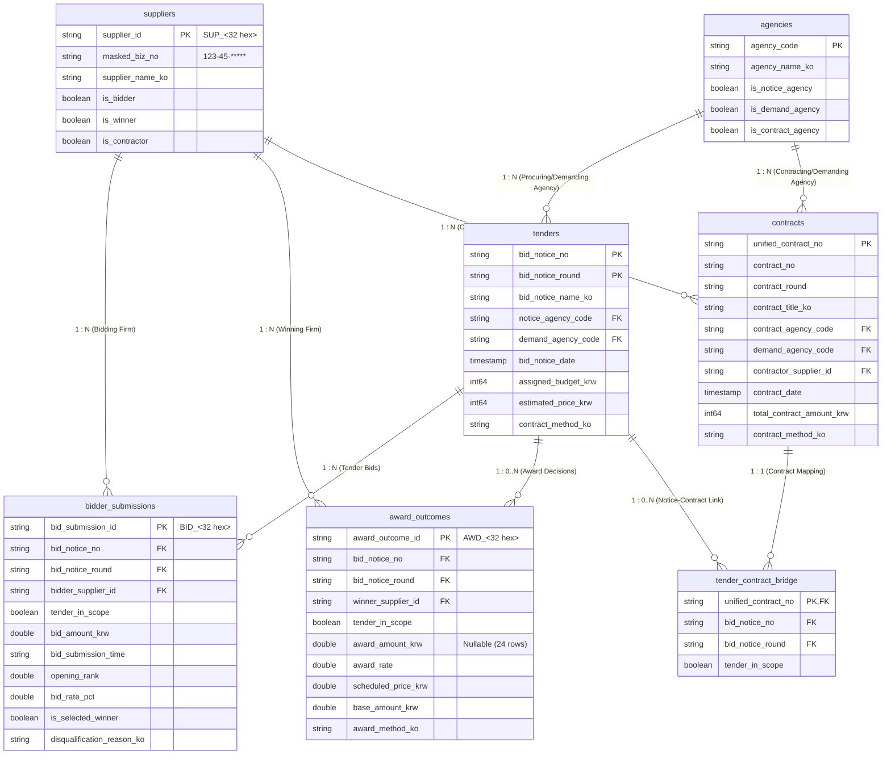

# South Korea Public Procurement Relational Model Specification

[한국어](RELATIONAL_MODEL.md) | **English**

This document establishes the official relational schema architecture for KONEPS (Korea ON-line E-Procurement System) public procurement data, derived empirically from live API feeds (`bids`, `awards`, `contracts`).

---

## 1. Background & Core Architectural Principles

Empirical analysis from the August 2026 pilot dataset (~2.26 million raw records) established several fundamental structural characteristics:
1. **Extreme 1:N Tender-to-Bidder Submissions**: A single tender announcement attracts dozens to thousands of competing suppliers (average 240.9 bidders in construction; maximum 9,675 bidders for a single tender). The `awards` API feed (`getDataSetOpnStdScsbidInfo`) directly captures individual bidder submissions.
2. **Multi-Lot & Multi-Winner Reality**: Procurement tenders frequently split across multiple lots, classifications, or joint arrangements (40 tenders in August had 2+ winning bidders). The awards feed cannot be coerced into a simplistic 1:1 table without loss of information.
3. **Tender-to-Contract Asymmetry**: Only 35.08% of contracts link directly to a tender announcement identifier. The remaining 64.92% are predominantly private/direct contracts (96.21%) and off-notice competitive contracts (3.79%).
4. **Fan-Out Prevention Policy**: Flattening all feeds into a monolithic master table results in catastrophic row duplication and severe analytical distortion. We implement a clean star/snowflake relational model connected via an explicit bridge table.

---

## 2. Conceptual Entity Relationship Diagram (Mermaid)

---

## 3. Detailed Entities & Grain Specifications

### 3.1 `tenders` (Tender Announcement Master)
- **Concept**: A distinct procurement tender published by a public entity on KONEPS.
- **Intended Grain**: One tender notice and round (1 row per tender).
- **Primary Key**: `(bid_notice_no, bid_notice_round)`
- **Foreign Keys**:
  - `notice_agency_code` $\rightarrow$ `agencies.agency_code`
  - `demand_agency_code` $\rightarrow$ `agencies.agency_code`
- **Verification**: **LIVE VERIFIED** (100% unique across all 32,895 rows in August 2026).
- **Source Feed**: `bids` (`getDataSetOpnStdBidPblancInfo`).

---

### 3.2 `bidder_submissions` (Individual Bidder Submissions)
- **Concept**: A discrete bid submitted by an enterprise for a specific tender.
- **Physical Primary Key (Surrogate PK)**: `bid_submission_id` (`BID_<32 hex>`) — Deterministic SHA-256 surrogate key computed from the business grain canonical string (2,107,948 rows, 100% unique, 0 nulls).
- **Business Reconciliation Grain**: `(bid_notice_no, bid_notice_round, bidder_supplier_id, opening_rank, disqualification_reason_ko, bid_amount_krw, bid_submission_time)` — 7-column lossless key used to collapse post-opening snapshot updates in raw API responses (0 duplicates, 100% lossless proven).
- **Temporal Foreign Key**:
  - `tender_in_scope: bool` — Flag indicating whether the bid maps to a tender published within the scope window (1,569,500 in-scope / 74.46%; 538,448 prior-notice / 25.54%).
- **Foreign Keys**:
  - `(bid_notice_no, bid_notice_round)` $\rightarrow$ `tenders` (Temporal FK, Nullable: False)
  - `bidder_supplier_id` $\rightarrow$ `suppliers.supplier_id` (Nullable: False)
- **Cardinality**: `tenders (1) : bidder_submissions (N)` (Range: 1 to 9,675 bids per tender, mean: 84.4).
- **Verification**: **LIVE VERIFIED** (2,107,948 normalized rows in August 2026; lossless grain verified).
- **Source Feed**: `awards` (`getDataSetOpnStdScsbidInfo`).

---

### 3.3 `award_outcomes` (Final Opening & Award Decisions)
- **Concept**: The final adjudicated outcome indicating winning suppliers, prices, and rates.
- **Physical Primary Key (Surrogate PK)**: `award_outcome_id` (`AWD_<32 hex>`) — Deterministic SHA-256 surrogate key computed from award event canonical string (17,315 rows, 100% unique, 0 nulls).
- **Business Reconciliation Grain**: `(bid_notice_no, bid_notice_round, winner_supplier_id, award_amount_krw, bid_submission_time)` (17,315 rows match 100%).
- **Award Amount Null Forensics (24 Cases) & Policy**:
  - Exactly 24 rows out of 17,315 winners (0.14%) have NULL `award_amount_krw`.
  - Cause: In opening snapshots of qualification reviews (`qualification_review`, 21 rows), lowest price (1 row), and small-sum private contracts (1 row), post-opening scoring was in progress, leaving the final contract award amount unfinalized in this feed.
  - Imputation Policy: `DO NOT IMPUTE` — These values are strictly preserved as `NULL` without synthetic imputation. The surrogate key `award_outcome_id` guarantees complete uniqueness across all rows regardless of amount nullability.
- **Temporal Foreign Key**:
  - `tender_in_scope: bool` — 12,918 in-scope (74.61%), 4,397 prior-notice (25.39%).
- **Foreign Keys**:
  - `(bid_notice_no, bid_notice_round)` $\rightarrow$ `tenders`
  - `winner_supplier_id` $\rightarrow$ `suppliers.supplier_id`
- **Cardinality**: `tenders (1) : award_outcomes (0..N)`
  - 0 Winners: 8,197 tenders (32.82% - failed bids or pending review)
  - 1 Winner: 16,741 tenders (67.02% - standard single-winner award)
  - 2+ Winners: 40 tenders (0.16% - multi-item/lot allocations or joint awards)
- **Source Feed**: `awards` rows with `is_selected_winner == True`.

---

### 3.4 `contracts` (Executed Public Contracts)
- **Concept**: Legally executed contracts between public agencies and suppliers.
- **Intended Grain**: One national unified contract.
- **Primary Key**: `unified_contract_no` (`untyCntrctNo`)
- **Foreign Keys**:
  - `contract_agency_code` $\rightarrow$ `agencies.agency_code`
  - `demand_agency_code` $\rightarrow$ `agencies.agency_code`
  - `contractor_supplier_id` $\rightarrow$ `suppliers.supplier_id`
- **Verification**: **LIVE VERIFIED** (115,945 rows in August 2026; 0.0% null rate, 100.0% strictly unique).
- **Source Feed**: `contracts` (`getDataSetOpnStdCntrctInfo`).

---

### 3.5 `tender_contract_bridge` (Tender-Contract Relationship Bridge)
- **Concept**: Resolves the relationship between tender announcements and executed contracts.
- **Intended Grain**: One row per tender-linked contract (unlinked contracts are excluded from the bridge and preserved exclusively in `contracts`).
- **Primary Key**: `unified_contract_no` (strictly unique, 40,677 rows).
- **Temporal Foreign Key**:
  - `tender_in_scope: bool` — 9,138 in-scope (22.46%), 31,539 prior-notice (77.54%).
- **Foreign Keys**:
  - `unified_contract_no` $\rightarrow$ `contracts.unified_contract_no`
  - `(bid_notice_no, bid_notice_round)` $\rightarrow$ `tenders.(bid_notice_no, bid_notice_round)` (Nullable: True)
- **Empirical Ratios (August 2026)**:
  - Contracts linked to tender notice: **35.08%** (40,677 rows) $\rightarrow$ Recorded in bridge table.
  - Contracts without tender notice: **64.92%** (75,268 rows) $\rightarrow$ Preserved in `contracts` only (private contracts 72,418, off-notice competitive 2,850).
- **Design Rationale**: Prevents unintentional loss of non-tendered contracts during relational joins while cleanly supporting 1:N multi-contract allocations from a single tender (208 tenders).

---

### 3.6 `suppliers` (Supplier Dimension Table)
- **Concept**: Unified dimension of all enterprises and sole proprietors participating in procurement.
- **Primary Key**: `supplier_id` (**HMAC-SHA256** pseudonymized `SUP_<32 hex>` hash of normalized 10-digit registration number, 143,842 rows 100% unique).
- **Privacy Policy**: Raw business registration numbers are never published; public releases include a stable HMAC pseudo-ID (`supplier_id`) and masked string (`masked_biz_no`: `123-45-*****`).
- **Secret Key Separation**: The HMAC key is derived from a dedicated environment variable (`KONEPS_SUPPLIER_HMAC_KEY`), completely separated from the API key (`DATA_GO_KR_SERVICE_KEY`), and must remain stable across all dataset releases.
- **Empirical Volume (August 2026)**:
  - Distinct Bidders: 123,777
  - Distinct Winners: 13,374
  - Distinct Contractors: 59,233
  - Total Unique Suppliers: **143,842**

---

### 3.7 `agencies` (Procuring & Demanding Agency Dimension)
- **Concept**: Public sector bodies (national ministries, municipal authorities, state-owned corporations).
- **Primary Key**: `agency_code` (7-digit official administrative code, 14,091 rows 100% unique).
- **Empirical Volume (August 2026)**: Notice agencies: 5,690, demand agencies: 14,079, contract agencies: 12,347 $\rightarrow$ Total **14,091 unique public agencies** identified.

---

### 3.8 Physical Curated Tables Summary (`CURATED_SCHEMA_VERSION = "1.0.0"`)

| # | Table File | Row Count | Primary Key (PK) | Compressed Size (MiB) | Verification Status |
| :--- | :--- | :--- | :--- | :--- | :--- |
| 1 | `01_tenders.parquet` | 32,895 | `(bid_notice_no, bid_notice_round)` | 1.99 | **VERIFIED (0 dup / 0 null)** |
| 2 | `02_bidder_submissions.parquet` | 2,107,948 | `bid_submission_id` | 96.19 | **VERIFIED (0 dup / 0 null)** |
| 3 | `03_award_outcomes.parquet` | 17,315 | `award_outcome_id` | 2.01 | **VERIFIED (0 dup / 0 null)** |
| 4 | `04_contracts.parquet` | 115,945 | `unified_contract_no` | 10.21 | **VERIFIED (0 dup / 0 null)** |
| 5 | `05_suppliers.parquet` | 143,842 | `supplier_id` | 4.36 | **VERIFIED (0 dup / 0 null)** |
| 6 | `06_agencies.parquet` | 14,091 | `agency_code` | 0.21 | **VERIFIED (0 dup / 0 null)** |
| 7 | `07_tender_contract_bridge.parquet` | 40,677 | `unified_contract_no` | 0.71 | **VERIFIED (0 dup / 0 null)** |

---

## 4. Reassessment of the Bidder Report Export Role

Because the live OpenAPI feed `getDataSetOpnStdScsbidInfo` already provides full-fidelity bidder submissions (business registration numbers, bid amounts, bid rates, timestamps, ranks, and disqualification reasons), the role of the portal bidder report export (`bidder_outcomes` CSV/XLS/XLSX) has been adjusted:
- **Previous Role**: Mandatory core source
- **New Role**: **Optional Enrichment & Cross-Validation**
- **Report-Exclusive Fields**:
  - Detailed supplier municipal district (`bidder_sigungu_ko`)
  - Corporate scale classification at contract time (SME, micro-enterprise)
  - Extended multi-year contract subdivision tags
- **Strategy**: Decouples historical bulk crawling from manual portal exports while preserving ingestion compatibility for focused localized analyses.

---

## 5. Dataset Publication & Format Policy

1. **Canonical Analytical Format**:
   - **Partitioned Apache Parquet (Zstandard compression)**
   - Date partitioning: `year=YYYY/month=MM/`
   - Strict typing: nullable boolean (`boolean` dtype), nanosecond timestamps (`datetime64[ns]`), int64, and float64.
2. **Raw Archival Storage**:
   - Immutable `.jsonl.gz` with atomic writes and SHA-256 manifests.
3. **Auxiliary Export Formats**:
   - CSV: Summary dimension tables and data dictionaries.
   - XLSX: Human-readable reports under 100,000 rows.
   - **Constraint**: Multi-million-row submission tables are never exported to Excel formats.
