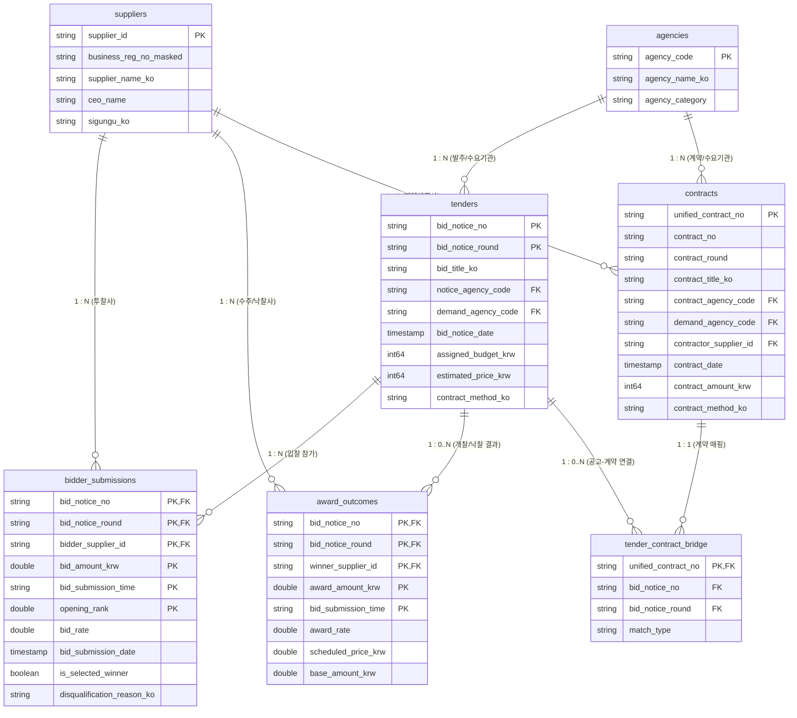

# 대한민국 공공조달 관계형 모델 규격서 (Relational Model Specification)

**한국어** | [English](RELATIONAL_MODEL.en.md)

본 문서는 나라장터(KONEPS) 공공조달 데이터의 개방표준 API 피드(`bids`, `awards`, `contracts`) 실증 분석을 기반으로 수립된 관계형 데이터 모델(Relational Schema Specification)을 정의합니다.

---

## 1. 배경 및 핵심 설계 원칙

2026년 8월 1개월 파일럿(약 226만 행) 실증 분석을 통해 확인된 조달 데이터의 구조적 특성은 다음과 같습니다:
1. **입찰공고와 투찰의 극단적 1:N 관계**: 단일 입찰공고에 대해 수십~수천 개 기업이 참가하며(공사 분야 평균 240.9개사, 단일 공고 최대 9,675개사), 개찰결과 피드(`awards`)는 실제 '개별 기업별 투찰 행위(Bidder Submissions)'를 반환합니다.
2. **복수 낙찰자 및 다수 물품 분할(Multi-lot) 존재**: 단일 공고에 복수의 낙찰자 및 물품군이 존재(2개사 이상 낙찰 공고 40건)하므로 개찰 결과를 단일 1:1 낙찰 테이블로 단순 축약할 수 없습니다.
3. **계약과 공고의 비대칭성**: 계약의 35.08%만 입찰공고번호와 직접 결합되며, 나머지 64.92%는 공고 없이 체결된 수의계약(96.21%) 및 자체 경쟁계약(3.79%)입니다.
4. **팬아웃(Fan-out) 방지 원칙**: 모든 피드를 단일 마스터 테이블로 성급하게 비정규화(Flattening)하면 수천 배의 행 뻥튀기(Row duplication)와 데이터 왜곡이 발생합니다. 따라서 스타/스노우플레이크 관계형 모델과 명시적 브릿지(Bridge) 테이블을 설계합니다.

---

## 2. 개념적 개체 관계도 (Mermaid ER Diagram)

---

## 3. 세부 엔터티 및 그레인(Grain) 규격

### 3.1 `tenders` (입찰공고 마스터)
- **개념**: 공공기관이 나라장터에 발주 공고한 1건의 입찰 건.
- **의도된 그레인 (Intended Grain)**: 단일 입찰공고 및 차수 (1 공고 1 행).
- **기본 키 (Primary Key)**: `(bid_notice_no, bid_notice_round)`
- **외래 키 (Foreign Keys)**:
  - `notice_agency_code` $\rightarrow$ `agencies.agency_code`
  - `demand_agency_code` $\rightarrow$ `agencies.agency_code`
- **검증 상태**: **LIVE VERIFIED** (2026년 8월 기준 32,895행 전수 100% 고유성 확인).
- **원천 피드**: `bids` (`getDataSetOpnStdBidPblancInfo`)

---

### 3.2 `bidder_submissions` (개별 기업 투찰 기록)
- **개념**: 특정 입찰공고에 대해 참여 기업이 제출한 개별 투찰 내역.
- **의도된 그레인 (Intended Grain)**: 특정 공고·차수 내 개별 기업의 1회 입찰 투찰 제출 건.
- **기본 키 (Primary Key)**: `(bid_notice_no, bid_notice_round, bidder_supplier_id, bid_amount_krw, bid_submission_time, opening_rank)`
- **외래 키 (Foreign Keys)**:
  - `(bid_notice_no, bid_notice_round)` $\rightarrow$ `tenders` (Nullable: False)
  - `bidder_supplier_id` $\rightarrow$ `suppliers.supplier_id` (Nullable: False)
- **카디널리티**: `tenders (1) : bidder_submissions (N)` (공고당 1 ~ 9,675행, 평균 84.4행).
- **검증 상태**: **LIVE VERIFIED** (2026년 8월 기준 2,107,948행 정규화 완료, 무손실 검증 통과).
- **원천 피드**: `awards` (`getDataSetOpnStdScsbidInfo`)

---

### 3.3 `award_outcomes` (최종 개찰/낙찰 결과)
- **개념**: 적격심사 및 최종 낙찰 결정이 완료된 낙찰 결과.
- **의도된 그레인 (Intended Grain)**: 특정 공고·차수 내 낙찰 건 (분할 발주 시 물품군별 1행).
- **기본 키 (Primary Key)**: `(bid_notice_no, bid_notice_round, winner_supplier_id, award_amount_krw, bid_submission_time)`
- **외래 키 (Foreign Keys)**:
  - `(bid_notice_no, bid_notice_round)` $\rightarrow$ `tenders`
  - `winner_supplier_id` $\rightarrow$ `suppliers.supplier_id`
- **카디널리티**: `tenders (1) : award_outcomes (0..N)`
  - 0 낙찰자: 8,197건 (32.82% - 유찰 또는 심사 진행 중)
  - 1 낙찰자: 16,741건 (67.02% - 표준 단일 낙찰)
  - 2인 이상 복수 낙찰자: 40건 (0.16% - 다수 품목 분할계약 또는 공동이행)
- **검증 상태**: **LIVE VERIFIED**
- **원천 피드**: `awards` (`getDataSetOpnStdScsbidInfo` 중 `is_selected_winner == True` 또는 최종낙찰 필드 보유 행).

---

### 3.4 `contracts` (계약 체결 내역)
- **개념**: 발주기관과 공급기업 간 법적으로 체결된 최종 조달 계약.
- **의도된 그레인 (Intended Grain)**: 정부 통합계약 1건.
- **기본 키 (Primary Key)**: `unified_contract_no` (`untyCntrctNo`)
- **외래 키 (Foreign Keys)**:
  - `contract_agency_code` $\rightarrow$ `agencies.agency_code`
  - `demand_agency_code` $\rightarrow$ `agencies.agency_code`
  - `contractor_supplier_id` $\rightarrow$ `suppliers.supplier_id`
- **고유성 검증**: **LIVE VERIFIED** (2026년 8월 기준 115,945행 중 결측률 0.0%, 고유율 100.0%).
- **원천 피드**: `contracts` (`getDataSetOpnStdCntrctInfo`)

---

### 3.5 `tender_contract_bridge` (공고-계약 연결 브릿지)
- **개념**: 입찰공고와 최종 계약 간의 릴레이션 매핑을 담당하는 관계 브릿지 테이블.
- **의도된 그레인**: 계약 1건당 연결된 공고 매핑.
- **기본 키 (Primary Key)**: `unified_contract_no`
- **외래 키 (Foreign Keys)**:
  - `unified_contract_no` $\rightarrow$ `contracts.unified_contract_no`
  - `(bid_notice_no, bid_notice_round)` $\rightarrow$ `tenders.(bid_notice_no, bid_notice_round)` (Nullable: True)
- **카디널리티 실측**:
  - 공고와 직접 연결되는 계약: **35.08%** (40,677건)
  - 공고 미연결 계약: **64.92%** (75,268건)
    - 미연결 계약 중 수의계약(`contract_method == '수의계약'`): **96.21%** (72,418건)
    - 미연결 계약 중 경쟁계약(제한/일반/지명경쟁): **3.79%** (2,850건)
- **설계 의의**: 미연결 계약을 공고와 억지로 Inner Join하여 누락시키는 오류를 방지하고, 단일 공고가 여러 계약으로 분할 체결되는 1:N 관계(208건)를 안전하게 수용합니다.

---

### 3.6 `suppliers` (공급업체 차원 테이블)
- **개념**: 조달시장에 참여하는 기업/개인사업자 마스터.
- **기본 키 (Primary Key)**: `supplier_id` (10자리 정규화 사업자등록번호 기반 **HMAC-SHA256** 해시 ID)
- **식별자 가명화 정책**: 공개 Kaggle 데이터셋 배포 시 사업자등록번호 원문은 비공개하며, 안전한 단방향 HMAC 키(`supplier_id`)와 마스킹된 번호(`123-45-*****`)를 제공합니다. HMAC 키는 비공개 서버 키(`DATA_GO_KR_SERVICE_KEY`)로 서명되어 평문 해시 역산 공격에 내성이 있습니다.
- **실측 규모 (2026년 8월)**:
  - 투찰 기업: 123,777개사
  - 낙찰 기업: 13,376개사
  - 계약 체결 기업: 59,233개사
  - 총 고유 기업: **143,842개사**
  - 낙찰사의 계약 일치율: **85.0%** (11,370개사 일치)

---

### 3.7 `agencies` (발주 및 수요기관 차원 테이블)
- **개념**: 공공물품을 발주하거나 실제 사용하는 국가기관, 지자체, 공기업.
- **기본 키 (Primary Key)**: `agency_code` (공공데이터포털 7자리 표준 기관코드)
- **실측 규모 (2026년 8월)**: 총 **14,091개 기관** 식별 완료.

---

## 4. 포털 투찰보고서(Bidder Report Export)의 위상 재정립

공공데이터포털 `PubDataOpnStdService` v1.2 실 API 수집 결과, `awards` 피드가 이미 개별 투찰 기업의 세부 정보(사업자등록번호, 투찰금액, 투찰률, 투찰일시, 개찰순위, 탈락사유)를 전수 제공함이 입증되었습니다.

따라서 나라장터 웹 화면에서 수동 추출하는 개찰결과 투찰보고서(CSV/XLS/XLSX)의 프로젝트 내 위상은 다음과 같이 조정됩니다:
- **기존**: 필수 1차 원천 데이터
- **변경**: **선택적 교차 검증 및 데이터 강화(Optional Enrichment & Cross-Validation)**
- **보고서 전용 추가 필드**:
  - 기업 소재 시군구(`bidder_sigungu_ko`)
  - 계약 시점 기업 구분(중소기업, 소상공인 등)
  - 상세 신규/장기계약 플래그
- **활용 방안**: 대용량 파이프라인의 핵심 종속성을 제거하고, 특정 심층 분석 대상 공고에 대한 지역제한 타당성 검증 등의 보조 데이터로 활용합니다.

---

## 5. 데이터 배포 포맷 정책 (Release Policy)

1. **정규 분석용 데이터 (Canonical Format)**:
   - **Partitioned Apache Parquet (Zstandard 압축)**
   - 날짜 기반 파티셔닝: `year=YYYY/month=MM/`
   - 스키마 엄격성: Nullable 불리언(`boolean` dtype), 일시 정규화(`datetime64[ns]`), 64비트 정수 및 부동소수점.
2. **원천 아카이브 (Raw Storage)**:
   - 불변(Immutable) `*.jsonl.gz` + SHA-256 무결성 검증.
3. **사용자 편의용 보조 익스포트 (Optional Exports)**:
   - 소규모 요약 통계 테이블 및 데이터 사전: CSV 형식 제공.
   - 10만 행 미만의 요약 리포트: XLSX 형식 허용.
   - **주의**: 수백만 행 규모의 `bidder_submissions` 전체를 XLS/XLSX로 변환하여 배포하지 않습니다.
